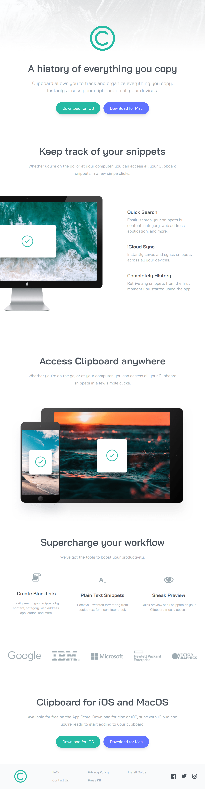

# FrontendMentor--clipboard-tailwind-css

Clipboard landing page challenge using CSS framework - Tailwind CSS

Clipboard landing page challenge from [Frontend Mentor Challenge](https://www.frontendmentor.io/challenges/clipboard-landing-page-5cc9bccd6c4c91111378ecb9) using CSS framework - Tailwind CSS. Author of this page is Brad Traversy in his [Tailwind CSS From Scratch course](https://www.traversymedia.com/tailwind-css-course)

## Usage

Install dependencies

```
npm install
```

Run Tailwind CLI

```
npm run watch
```

### Screenshot



## My Contact

- Website - [Petr Bednarski](https://github.com/pettik)
- Frontend Mentor - [@pettik](https://www.frontendmentor.io/profile/pettik)
